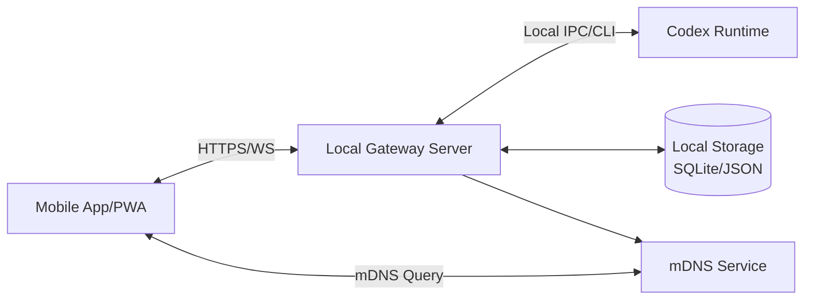

# Codex Interface アーキテクチャ設計

最終更新: 2026-05-14

## 1. ゴール
- 同一LANのPC上Codexをスマホから安全に操作・閲覧する。
- MVPでは導入容易性と運用の軽さを優先する。

## 2. 論理構成

## 3. コンポーネント
- Mobile App/PWA
  - 接続先探索、認証、操作、ログ表示
  - オフライン時の再接続制御
- Local Gateway Server（PC常駐）
  - REST API（認証・設定・履歴）
  - WebSocket（リアルタイムイベント）
  - Codex実行制御（起動/停止/コマンド送信）
  - 認可と監査ログ
- Codex Runtime
  - 実際のモデル/実行環境
- Local Storage
  - 接続設定、セッション、操作履歴、監査ログ
- mDNS Service
  - LAN内発見のためのサービス広告

## 4. データフロー
1. MobileがmDNSまたは手動入力でGateway候補を検出
2. PIN入力で認証開始、短期JWT取得
3. RESTで初期状態取得（version, health, active session）
4. WebSocket接続しイベント購読
5. 操作はREST経由で要求、結果はWSイベントで通知
6. 操作・結果をGatewayが永続化

## 5. デプロイモデル（MVP）
- 単一PCノード（Gateway + Codex）
- 単一LANセグメント
- 単一ユーザーまたは家庭内少人数を想定

## 6. 障害対応方針
- WS切断時: 指数バックオフで再接続（1s, 2s, 5s, 10s, max 30s）
- Gateway再起動時: mobileはhealth endpointで復帰検知
- Codex停止時: state=degradedを返し、UIで再起動導線を表示

## 7. 拡張余地
- Remote relay（外部アクセス）
- 多ユーザーRBAC
- 監査ログの暗号化保管
- プラグイン方式（複数Codex backend）
